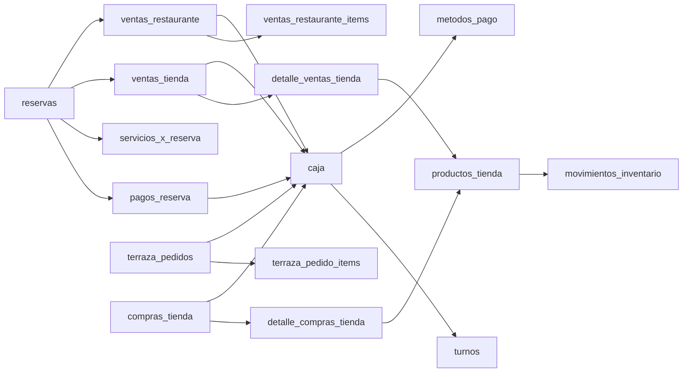

# Auditoría financiera — mapa de datos

## 1. Leyenda

- **Snapshot**: objeto confirmado en la captura versionada de esquema.
- **Migración posterior**: definido después del baseline; requiere confirmar despliegue productivo.
- **Frontend**: objeto consultado/escrito por el código actual.
- `!` indica campo conceptualmente obligatorio para el flujo, aunque la nulabilidad real se detalla cuando es relevante.

## 2. Mapa lógico del dinero

No existe una entidad superior que consolide cada hecho económico. `caja` es el único agregado transversal, pero representa movimiento operativo de dinero, no asiento contable.

## 3. Tablas financieras y operativas principales

### `caja` — snapshot + frontend

Propósito: movimientos de apertura, ingreso, egreso, ajuste y potencial cierre.

Campos: `id`, `hotel_id`, `tipo`, `monto`, `concepto`, `fecha_movimiento`, `metodo_pago_id`, `usuario_id`, `turno_id`, `reserva_id`, `pago_reserva_id`, `venta_tienda_id`, `venta_restaurante_id`, `compra_tienda_id`, `referencia`, `creado_en`, `actualizado_en`; migraciones agregan `venta_terraza_id`.

Relaciones: hotel, usuario, turno, método, reserva, pago y documentos de venta/compra. Varias son opcionales; no hay restricción que exija exactamente una fuente ni idempotencia por referencia.

Creación/actualización: RPC para movimiento manual y apertura; inserts frontend para numerosos cobros/compras; RPC de Terraza. El método puede editarse directamente. El movimiento puede borrarse mediante RPC con copia a log y también la política RLS capturada permite DELETE directo.

Consumidores: Caja, cierres, Reportes, dashboard, usuarios, conciliación bancaria piloto.

### `turnos` — snapshot + frontend

Campos: `id`, `hotel_id`, `usuario_id`, `fecha_apertura`, `fecha_cierre`, `estado`, `balance_final`.

Relaciones: hotel/usuario; `caja.turno_id`. Índice único parcial por hotel/usuario abierto.

Creación: `abrir_turno_con_apertura`. Cierre: `cerrar_turno_con_balance`. No guarda saldo inicial propio, arqueo real por método, diferencia, notas o aprobador; la apertura se deriva de `caja`.

### `metodos_pago` — snapshot + frontend

Campos: `id`, `hotel_id`, `nombre`, `activo`, timestamps. Catálogo libre por hotel; permite efectivo, transferencia, QR, Llave o tarjeta solo como nombres, sin tipo normalizado ni cuenta financiera asociada.

### `reservas` — snapshot + frontend

Campos financieros: `hotel_id`, `monto_total`, `monto_pagado`, `metodo_pago_id`, `monto_estancia_base`, impuestos, descuento, `monto_descontado`, fechas y estado.

Relaciones: habitación, cliente, método, usuario, descuento; hijos `pagos_reserva`, servicios y ventas cargadas a habitación.

Creación/actualización: varios formularios/RPC/integraciones. Puede editarse y borrarse físicamente. `monto_pagado` es un agregado redundante de `pagos_reserva` y puede divergir.

### `pagos_reserva` — snapshot + frontend

Campos: `id`, `hotel_id`, `reserva_id`, `monto`, `fecha_pago`, `metodo_pago_id`, `usuario_id`, `concepto`, descuento, timestamps.

Relaciones: reserva, hotel, método, usuario; referenciado por `caja.pago_reserva_id` y `servicios_x_reserva.pago_reserva_id`.

Creación: abonos/cobros de distintos módulos. Actualización/eliminación permitidas por RLS del hotel. No tiene estado, void/reversal, idempotency key, cuenta destino ni referencia externa uniforme.

### `pagos_cargos` — snapshot, sin flujo activo encontrado

Campos: `pago_id`, `modulo`, `cargo_id`, `monto_cubierto`, `creado_en`. Parece diseñado para aplicar pagos a cargos, pero no se encontró uso frontend/RPC relevante y `pago_id` no aparece con FK clara en el mapa capturado. Es una idea reutilizable tras verificar datos y restricciones.

### `servicios_x_reserva` — snapshot + frontend

Campos: hotel/reserva/servicio, cantidad, `precio_cobrado`, `estado_pago`, `pago_reserva_id`, descripción manual, fecha. Representa cargo, no costo. No hay costo del servicio ni asignación parcial.

## 4. Tienda e inventario

### `productos_tienda`

Campos: `hotel_id`, nombre, `precio`, `precio_venta`, `stock`, `stock_actual`, mínimos/máximos, proveedor, categoría, activo. Tiene pares legacy (`precio`/`precio_venta`, `stock`/`stock_actual`) que pueden divergir. **No tiene costo**.

### `ventas_tienda`

Campos: `hotel_id`, `total_venta`, método, usuario, fechas, reserva/habitación/cliente, `estado_pago`, descuentos. Cabecera de venta; no guarda costo, estado de anulación ni clave idempotente.

### `detalle_ventas_tienda`

Campos: venta, producto, cantidad, `precio_unitario_venta`, subtotal, hotel y fecha. FK a venta con `ON DELETE CASCADE`. No congela costo unitario.

### `compras_tienda`

Campos: hotel, usuario, proveedor, `total_compra`, fecha, estado, recepción y fechas. Es orden/recepción, no factura de proveedor. No tiene vencimiento, saldo, número fiscal, impuestos, comprobante, moneda ni estado de pago.

### `detalle_compras_tienda`

Campos: compra, producto, cantidad, `precio_unitario`, subtotal, hotel, recibido. Es la única fuente histórica aproximada de costo de tienda, pero no se conecta a la salida vendida.

### `movimientos_inventario`

Campos: hotel, producto o ingrediente, tipo, cantidad, razón/notas, usuario, stock anterior/nuevo y fecha. Sirve como historial físico, no valorado. No tiene costo unitario/total, lote, compra origen, venta origen uniforme ni reversal.

### `proveedores`

Campos: hotel, identidad/contacto/NIT, activo y timestamps. Reutilizable, pero no tiene condiciones de pago, cuenta bancaria, documentos ni saldos.

### `solicitudes_salida_inventario_tienda` — migración posterior

Controla solicitud/aprobación/rechazo de salida de inventario. Mejora autorización física; no registra valor monetario ni efecto contable.

## 5. Restaurante

### `ventas_restaurante` / `ventas_restaurante_items`

Cabecera con hotel, usuario, montos, método, cliente/habitación/reserva, estado de pago, descuentos e impuestos. Items con plato, cantidad, precio y subtotal. Items no tienen `hotel_id` en el snapshot y dependen de la cabecera. No guardan costo histórico.

### `platos`, `platos_recetas`, `ingredientes`

`platos` guarda precio; `platos_recetas` cantidad de ingrediente; `ingredientes` stock, unidad y `costo_unitario`. Permiten receta teórica al costo actual, no CMV histórico. Las tres tablas relevantes carecen de RLS en el snapshot.

## 6. Terraza — migraciones posteriores

### `terraza_productos`

Precio, stock, categoría y relación opcional a producto de tienda. Sin costo.

### `terraza_pedidos`

Hotel, mesa/silla, usuario, estado, total, método, turno, fechas. Migraciones posteriores agregan anticipos, propina, reapertura, reserva y `pagos_mixtos` JSON. Reutilizable como documento de venta.

### `terraza_pedido_items`

Pedido, hotel, producto, nombre congelado, cantidad, precio, subtotal. Trigger recalcula total. Sin costo congelado.

### `terraza_reservas`

Reserva de mesa con anticipo/consumibles según migración. Debe distinguirse del ingreso de alojamiento y del pedido final.

## 7. Logs y auditoría

| Tabla | Función | Limitación |
| --- | --- | --- |
| `bitacora` | acciones de módulos | cobertura voluntaria, sin RLS en snapshot |
| `log_caja_eliminados` | copia JSON antes de borrar caja | no es reversión; función capturada no valida actor |
| `caja_movimientos_eliminados` | segundo concepto de log | duplicidad/uso no claro |
| `eventos_sistema` | telemetría/auditoría sensible | no ledger financiero |
| `bank_payment_audit_log` | auditoría bancaria | solo migración piloto local |

## 8. Piloto bancario — migración local no versionada al inicio de la auditoría

| Tabla | Propósito |
| --- | --- |
| `bank_email_integrations` | configuración Gmail/llaves por hotel |
| `bank_email_oauth_states` | OAuth temporal |
| `bank_email_pubsub_inbox` | cola/idempotencia de notificaciones |
| `expected_payments` | expectativa de pago ligada a reserva/habitación/venta |
| `bank_payment_events` | evento bancario detectado, fingerprint, monto, fecha, match y revisión |
| `bank_payment_audit_log` | acciones inmutables del proceso |

El diseño contiene buenos elementos: restricciones por hotel, fingerprints únicos, estados, revisión y auditoría. Aún no representa una cuenta bancaria/estado de cuenta completo y no sustituye el ledger financiero propuesto.

## 9. Entidades buscadas y equivalencias reales

| Concepto esperado | Nombre real / resultado |
| --- | --- |
| transactions | no existe; aproximación `caja` |
| payments | `pagos_reserva`; `pagos` es facturación SaaS, no hotel |
| expenses/income | no existen; `caja.tipo` |
| cash_movements | `caja` |
| cash_sessions | `turnos` |
| reservations/bookings | `reservas`; `terraza_reservas` |
| room_consumptions | `servicios_x_reserva` + ventas ligadas a reserva |
| store_sales/products | `ventas_tienda`, detalles, `productos_tienda` |
| inventory_movements | `movimientos_inventario` |
| restaurant_orders | `ventas_restaurante`; Terraza usa `terraza_pedidos` |
| employees/payroll | `usuarios` no es nómina; payroll no existe |
| suppliers | `proveedores` |
| budgets/accounts/assets/liabilities | no existen |

## 10. Integridad y relaciones faltantes

- No hay unicidad `caja(pago_reserva_id)`; un pago puede reflejarse varias veces en caja.
- No hay restricción de suma que iguale pagos mixtos frontend al total salvo Terraza.
- No hay check transversal de que hotel de referencia coincida con `caja.hotel_id`.
- `monto_pagado` duplica la suma de pagos.
- ventas y caja no tienen estado común de reversión.
- detalles de venta no congelan costo.
- las políticas RLS permisivas hacen que el mapa relacional no sea una frontera de seguridad.
