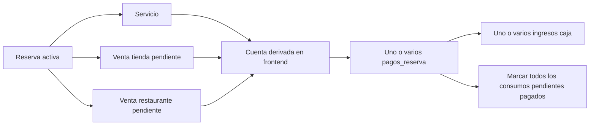
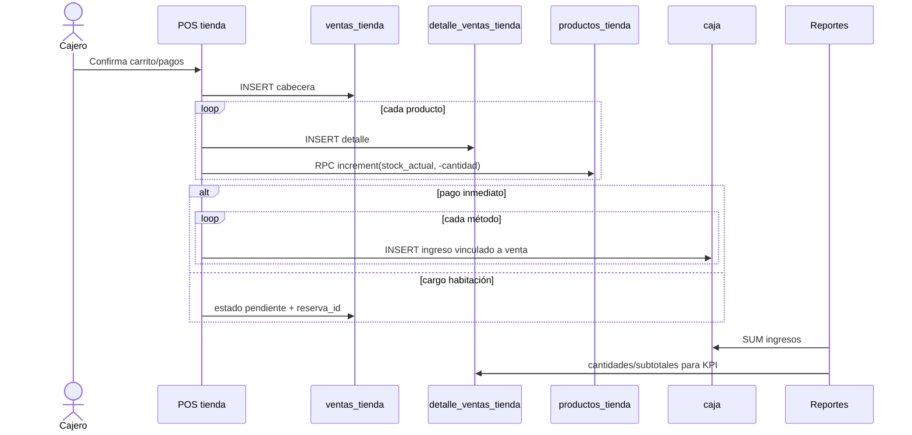
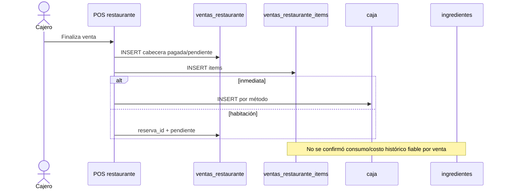
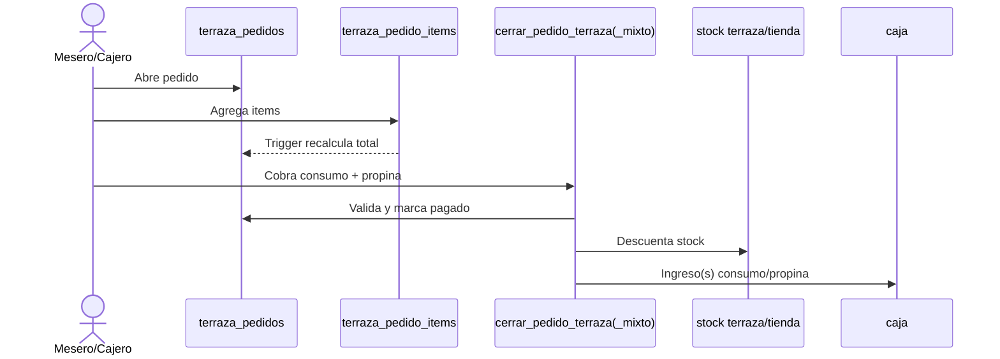
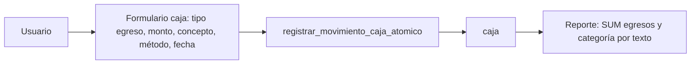
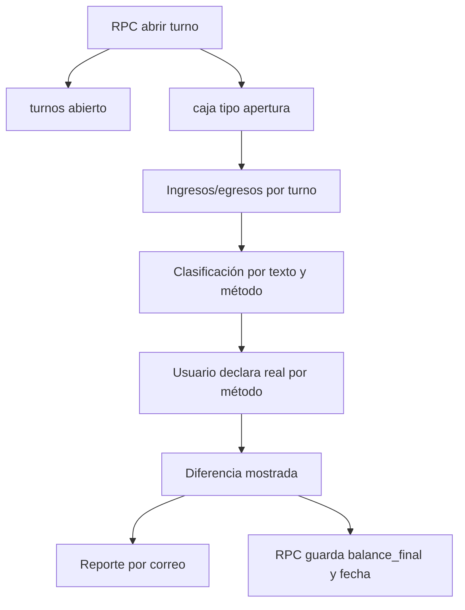
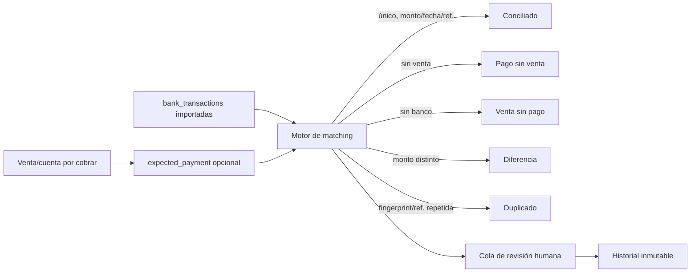

# Auditoría financiera — flujos de dinero

## 1. Habitación → pago → caja → reporte

```mermaid
sequenceDiagram
  actor U as Recepción
  participant FE as Frontend
  participant R as reservas
  participant P as pagos_reserva
  participant C as caja
  participant REP as Reportes/Cierre
  U->>FE: Registra abono o pago total
  FE->>P: INSERT monto, método, hotel, usuario
  FE->>R: UPDATE monto_pagado
  alt turno activo
    FE->>C: INSERT ingreso con pago_reserva_id
  else sin turno (uno de los flujos)
    FE-->>U: Pago guardado; registre caja manualmente
  end
  REP->>C: SUM(monto) por fecha/tipo/concepto
```

Evaluación:

- El cobro real está duplicado en `pagos_reserva` y `caja`.
- Las escrituras no son atómicas en los flujos activos del navegador.
- `reservas.monto_pagado` es un tercer valor derivado que puede divergir.
- No existe unicidad para impedir dos filas de caja por el mismo pago.
- La reserva puede borrarse junto con pagos; la cancelación también borra caja/pagos.
- Reportes de habitaciones dependen de `reserva_id` o patrones de texto.

### Cargo de consumos a habitación



No hay aplicación detallada pago↔cargo. Un pago parcial puede marcar grupos completos como pagados o dejar un agregado difícil de reconstruir.

## 2. Tienda → venta → inventario → caja → reporte



Riesgos:

- secuencia no transaccional;
- errores de inserts/RPC dentro del bucle no siempre se verifican;
- reintento sin idempotencia;
- no se registra movimiento de inventario de venta en el flujo mostrado, solo decremento genérico;
- no se congela costo;
- precio y descuento se calculan en cliente;
- si se borra caja, una migración reciente intenta restaurar stock, pero borrar una evidencia de cobro no debería deshacer necesariamente la venta física; mezcla reversión financiera e inventario.

## 3. Restaurante → orden/venta → pago → caja → reporte



El RPC histórico `procesar_venta_restaurante_y_caja` es atómico, pero el frontend actual usa escrituras separadas. La función antigua de descuento de ingredientes referencia un modelo de recetas no presente; no debe considerarse prueba de CMV operativo.

## 4. Terraza → pedido → inventario → caja → reporte



Este es el flujo mejor encapsulado. Continúa faltando costo de inventario/CMV, cuenta de propinas por pagar y generalización multi-hotel.

## 5. Gasto → pago → caja/banco → reporte

### Gasto manual actual



No hay documento de gasto independiente. Por tanto, el sistema no representa gasto pendiente, fecha de vencimiento, proveedor, comprobante, pago parcial, recurrencia, centro de costo ni cuenta origen.

### Compra tienda actual

```mermaid
flowchart LR
  OC[compras_tienda] --> DET[detalle_compras_tienda]
  DET --> REC[Recepción]
  REC --> INV[Incrementar stock]
  REC --> EST[Marcar recibido]
  REC --> C[Crear egreso(s) caja]
  C --> REP[Reporte]
```

Recepción y pago son una sola acción conceptual, aunque se ejecutan en varias llamadas. No existen factura/saldo/vencimiento.

## 6. Apertura y cierre de turno



El arqueo y las diferencias no se guardan de forma estructurada. El email es evidencia externa, no fuente transaccional.

## 7. Fechas y corte diario

La fecha de operación puede ser `fecha_movimiento`, `fecha_pago`, `fecha`, `fecha_venta`, `fecha_inicio`, `creado_en` o `created_at`. Varios reportes construyen límites `T00:00:00.000Z` y `T23:59:59.999Z`; Bogotá es UTC-5. Por ejemplo, un pago a las 22:30 de Bogotá corresponde a 03:30Z del día siguiente: según la columna y conversión usada puede asignarse a días distintos.

Recomendación: conservar `occurred_at timestamptz`, `business_date date` calculada con la zona del hotel, `recorded_at`, y una zona horaria obligatoria por hotel. Los cierres deben usar `business_date`, no cortar implícitamente en UTC.

## 8. Conciliación bancaria propuesta



El piloto local ya aporta parser Bancolombia, fingerprint, eventos, expectativas y auditoría. Para arquitectura definitiva:

1. separar `bank_transactions` de la fuente Gmail; Gmail es un importador, no el modelo bancario;
2. asociar cada transacción a `account_id` y hotel;
3. usar tabla de reconciliaciones N:M o 1:N, no columnas polimórficas `sale_id/sale_type` como única relación;
4. no crear ingresos automáticamente al detectar correo; primero importar, proponer match y confirmar;
5. mantener hash/fingerprint y referencia bancaria únicos por cuenta;
6. permitir diferencias, comisiones, pagos agrupados y pagos parciales;
7. auditar cada cambio y prohibir borrado físico.
