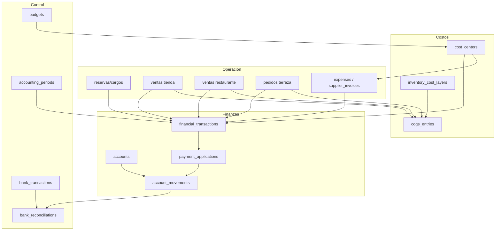

# Auditoría financiera — propuesta de nuevo modelo

## 1. Principios

El objetivo no es un ERP. Se propone un núcleo financiero pequeño que mantenga rápida la operación:

1. registrar una vez cada hecho económico;
2. separar documento (venta/gasto) de movimiento de dinero;
3. usar referencias estructuradas, no texto, para reportar;
4. conservar historia mediante reversión, nunca borrado;
5. obligar `hotel_id` y validar tenant en base de datos;
6. ejecutar operaciones críticas en RPC transaccionales e idempotentes;
7. permitir P&L y flujo de caja desde fuentes distintas pero reconciliables;
8. capturar costo histórico al vender.

## 2. Arquitectura propuesta



## 3. Entidades recomendadas

### Crear ahora (núcleo)

#### `financial_transactions`

Cabecera inmutable de hecho económico: venta, gasto, compra, retiro, aporte, activo, deuda, ajuste o reversión.

Campos mínimos: `id`, `hotel_id`, `transaction_type`, `status`, `business_date`, `occurred_at`, `currency`, `total_amount`, `source`, `source_id`, `cost_center_id`, `description`, `created_by`, `created_at`, `posted_at`, `posted_by`, `reversed_transaction_id`, `void_reason`, `idempotency_key`.

No debe duplicar todos los documentos operativos; los referencia. Será fuente de P&L por tipo/fecha devengada.

#### `accounts`

Cuentas de dinero: caja principal, caja por turno si aplica, Bancolombia HOTELOK, Bancolombia Hotel Marena, otra cuenta, billetera/tarjeta.

Campos: hotel, tipo (`cash`, `bank`, `wallet`, `clearing`), nombre, moneda, activo y últimos dígitos. `metodos_pago` se enlaza a una cuenta por defecto, pero no la reemplaza.

#### `account_movements`

Ledger de flujo de caja por cuenta. Cada cobro/pago/transferencia crea movimientos balanceables. Campos: cuenta, dirección/tipo, monto, fecha, transacción origen, método, turno, actor, estado/reversión e idempotencia.

`caja` puede coexistir temporalmente como vista/compatibilidad; a largo plazo se reemplaza o se convierte en proyección de este ledger.

#### `expense_categories`

Árbol simple de categorías con clasificación P&L: nómina, servicios, instalaciones, mantenimiento, vehículo, inventario, financieros, administración y otros. Campos para `parent_id`, tratamiento (`operating_expense`, `cogs`, `asset`, `liability_payment`, `owner`) y orden de reporte.

#### `cost_centers`

Por hotel: Habitaciones, Tienda, Terraza, Restaurante, Administración, Mantenimiento, Vehículo, Lavandería y Otros. Permitir uno principal y distribuciones porcentuales en tabla hija `transaction_allocations`.

#### `expenses` y `expense_payments`

`expenses`: documento de gasto/factura con proveedor opcional, categoría, centro, fecha del gasto, vencimiento, total, impuestos, comprobante, estado, recurrencia origen y porcentaje atribuible al hotel.

`expense_payments`: cada pago parcial, fecha, cuenta, método, monto y movimiento de cuenta. `paid_amount` y `balance_due` deben derivarse, no editarse libremente.

Esto resuelve factura de luz $8M → pago $5M → saldo $3M → pago final.

#### `payment_applications`

Aplica cobros de cliente a cargos/documentos: alojamiento, servicios, tienda, restaurante. Reutiliza la intención de `pagos_cargos`, pero con FKs/validación y montos parciales. Evita marcar todos los extras pagados sin asignación.

#### `accounting_periods`

Mes por hotel: abierto/cerrado, cerrado por/fecha, reapertura autorizada. Bloquea retroactividad y fija reportes.

### Crear en segunda etapa

#### `inventory_purchases`, `inventory_purchase_items`, `inventory_cost_layers`, `cogs_entries`

Puede reutilizarse `compras_tienda` inicialmente, pero el costeo requiere capas. Se recomienda costo promedio móvil por simplicidad (no FIFO visible al usuario), con capa/audit interno. Cada venta congela `unit_cost` y `total_cost` por item o crea `cogs_entries`.

Tienda y Terraza: costo desde recepción de compra/transferencia. Restaurante: costo de receta usando costo promedio vigente al vender, congelado por item/ingrediente.

#### `recurring_expenses`

Plantilla que genera borradores de gastos, nunca pagos automáticos implícitos. Frecuencia, próximo vencimiento, proveedor, categoría, centro y monto estimado.

#### `budgets` y `budget_lines`

Presupuesto mensual por hotel/categoría/centro. Real proviene de transacciones posteadas por fecha devengada. Fórmulas:

- diferencia = real − presupuesto;
- porcentaje = diferencia / presupuesto, con manejo explícito de cero.

#### `owners_transactions`

Crear entidad explícita o representar mediante `financial_transactions.transaction_type` más subtipo. Preferencia: tabla de documento liviana para retiro/aporte con propietario, razón y aprobación; movimiento de cuenta separado. Nunca gasto operativo.

#### `suppliers` / reutilizar `proveedores`

Reutilizar y ampliar `proveedores`; no crear duplicado `suppliers`. Agregar condiciones de pago y datos fiscales con RLS correcto.

#### `supplier_invoices`

Puede ser la evolución de `expenses` para facturas de proveedor. Para evitar complejidad inicial, usar una sola tabla `expenses` con `document_type`; separar solo cuando compras de inventario y facturación requieran recepción/three-way match.

### Crear después, cuando haya necesidad real

#### `assets`, `liabilities`, `liability_payments`

Necesarios para TV financiado/préstamos, pero no en fase inicial. Activo registra adquisición y vida útil básica; pasivo registra principal, saldo y cuotas. Interés es gasto; principal es reducción de deuda; salida bancaria es flujo.

No se propone depreciación contable completa inicialmente: bastan clasificación y calendario de deuda, con exportación a contador.

#### `bank_transactions` y `bank_reconciliations`

Generalizar el piloto Gmail. `bank_transactions` es proveedor-neutral y pertenece a `account_id`. La reconciliación enlaza uno o varios movimientos de cuenta con una o varias transacciones bancarias, con diferencia y estado.

## 4. Entidades de la lista que no conviene duplicar

| Entidad sugerida | Decisión |
| --- | --- |
| `financial_transactions` | Sí, núcleo económico |
| `expense_categories` | Sí |
| `expenses`, `expense_payments` | Sí |
| `recurring_expenses` | Sí, fase 2 |
| `accounts`, `account_movements` | Sí |
| `owners_transactions` | Sí o subtipo documentado; se prefiere tabla liviana |
| `suppliers` | No duplicar; ampliar `proveedores` |
| `supplier_invoices` | Integrar inicialmente en `expenses` |
| `budgets` | Sí, con líneas |
| `cost_centers` | Sí, con asignaciones |
| `inventory_purchases` | Reutilizar/evolucionar `compras_tienda`; unificar después |
| `inventory_cost_layers` | Sí, interno |
| `assets`, `liabilities` | Sí, fase posterior mínima |
| `bank_transactions`, `bank_reconciliations` | Sí, generalizando piloto |
| `accounting_periods` | Sí |

## 5. Estado de resultados

Fuente propuesta por fecha devengada (`business_date`):

```text
Ingresos posteados por centro
- CMV congelado de items vendidos
= Margen bruto
- Gastos operativos posteados (sin pagos de principal/retiros/activos)
= Utilidad operacional
```

Debajo, sin mezclarlos:

- retiros/aportes;
- compras de activos;
- principal de deuda e intereses separados;
- flujo neto por cuenta;
- saldos de caja y banco.

## 6. Roles y permisos propuestos

| Acción | Recepción | Administrador | Contabilidad | Propietario | Superadmin |
| --- | --- | --- | --- | --- | --- |
| Registrar gasto menor | Sí, límite/caja propia | Sí | Sí | Sí | soporte excepcional |
| Editar borrador propio | Sí, antes de postear | Sí | Sí | Sí | no por defecto |
| Anular/postear gasto | No | con límite | Sí | Sí | no por defecto |
| Proveedores/facturas | Lectura limitada | Sí | Sí | Sí | no por defecto |
| Ver ventas | turno/área propia | hotel | hotel | hotel/grupo | soporte auditado |
| Ver utilidad/P&L | No | opcional | Sí | Sí | solo impersonación auditada |
| Ver retiros propietario | No | No/permiso | Sí | Sí | restringido |
| Cerrar periodo | No | No | Sí | Sí | no por defecto |
| Conciliar banco | No | opcional | Sí | Sí | no por defecto |

Implementar permisos en base de datos/RPC, no solo navegación. Superadmin no debería ver finanzas automáticamente: usar acceso de soporte temporal, razón y auditoría.

## 7. Experiencia simple

Recepcionista: formulario “Salida de caja” con monto, categoría corta, concepto, evidencia opcional y cuenta/turno preseleccionados. Si supera límite, queda pendiente de aprobación.

Administrador: bandeja de facturas y proveedores, pagos parciales, vencimientos y recurrencias.

Propietario: dashboard con Ventas hoy/mes, Gastos mes (devengados), CMV, utilidad operacional, retiros, CxP, saldos por cuenta y presupuesto vs real. Cada cifra debe enlazar al detalle y mostrar definición/fuente.

## 8. Reglas de integridad obligatorias

- todas las tablas tenant-aware: `hotel_id NOT NULL` + FK;
- FKs compuestas o triggers/RPC que aseguren mismo hotel en referencias;
- montos positivos; dirección/tipo define signo;
- idempotency key única por hotel/fuente;
- estados con transiciones validadas;
- no DELETE/UPDATE de posteados; reversión enlazada;
- `created_by`, `updated_by` en borradores, `posted_by`, `reversed_by`;
- RLS restrictiva por hotel y permiso;
- RPC transaccional para venta+cobro+stock+CMV;
- zona horaria del hotel y `business_date` obligatoria;
- conciliaciones y periodos cerrados bloquean cambios.
