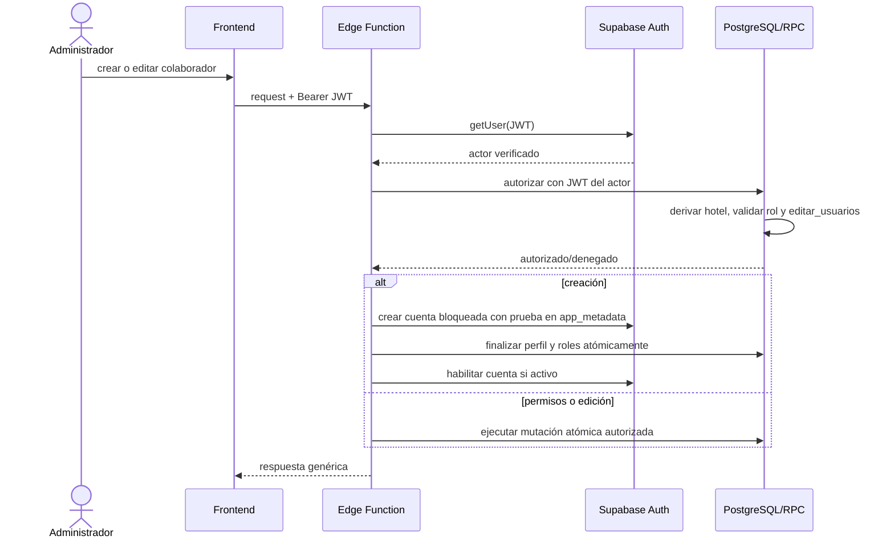

# Cierre P0: gestión de usuarios, roles y permisos

Fecha: 2026-09-08
Estado: implementación local completa; staging de Supabase aplicado y verificado; frontend staging pendiente por falta de vínculo Vercel; producción no modificada.

## Alcance

Este cambio corrige exclusivamente los hallazgos P0 relacionados con `crear_colaborador`, `actualizar_permisos_usuario` y los bypass directos de las tablas RBAC. No incluye los hallazgos P1/P2 del informe integral.

## Diagnóstico confirmado

- La versión desplegada de `crear_colaborador` verificaba la firma JWT en el gateway, pero no autenticaba ni autorizaba al actor dentro de la función. Además confiaba en `hotel_id` y roles enviados por el cliente antes de usar `service_role`.
- La versión desplegada de `actualizar_permisos_usuario` tenía `verify_jwt = false`, no validaba al actor y reemplazaba permisos con `service_role` usando datos controlados por el request.
- Las políticas y privilegios existentes permitían escrituras directas desde el cliente sobre `usuarios_roles` y `usuarios_permisos`. Eso habría permitido eludir una corrección limitada únicamente a las Edge Functions.
- La identidad SaaS dependía de señales que podían mezclarse con datos editables del perfil. La migración usa el correo confirmado de `auth.users` y mantiene compatibilidad con el rol explícito de confianza existente.
- `usuarios_permisos` no tiene una restricción única `(usuario_id, permiso_id)`. El reemplazo nuevo usa bloqueo de fila, borrado e inserción dentro de una sola transacción, sin depender de un `upsert` inválido.

## Solución aplicada

### Autenticación y autorización

- Las dos Edge Functions exigen `Authorization: Bearer <JWT>`, llaman `auth.getUser(token)` y rechazan tokens ausentes, inválidos, expirados o sesiones anónimas antes de cualquier operación privilegiada.
- La base de datos deriva el hotel del actor autenticado. Solo un SaaS superadmin verificado puede indicar explícitamente otro hotel.
- Un administrador de hotel debe estar activo, pertenecer al hotel y conservar el permiso efectivo `editar_usuarios`.
- No se permite modificar la propia cuenta, usuarios SaaS protegidos, ni asignar roles o permisos superiores a los del actor.
- Los roles se validan contra el catálogo permitido y se excluyen nombres privilegiados como `superadmin` y variantes SaaS.

### Operaciones atómicas

- `p0_actualizar_permisos_usuario` bloquea al objetivo, valida todo el payload y reemplaza sus excepciones de permisos en una sola transacción.
- `p0_editar_colaborador` actualiza perfil y roles en una sola transacción.
- `p0_finalizar_colaborador` vuelve a autorizar al actor, comprueba una prueba de aprovisionamiento guardada en `app_metadata`, crea perfil y roles, y consume la prueba en la misma transacción.
- `crear_colaborador` crea primero la cuenta Auth bloqueada. Solo la habilita después de completar perfil y roles; ante cualquier fallo intenta compensar Auth, perfil y configuración de turnos sin revelar detalles sensibles.

### Cierre de bypass por REST

- Se revocan escrituras directas de `authenticated`, `anon` y `PUBLIC` sobre `usuarios_permisos` y las actualizaciones/eliminaciones directas de `usuarios_roles`.
- Se restringe la inserción de roles al flujo de bootstrap del propietario inicial y a los RPC autorizados.
- Se agregan políticas restrictivas para impedir que un administrador actualice o elimine su propia cuenta o un SaaS superadmin por REST.
- Los RPC P0 tienen `SECURITY DEFINER`, `search_path` vacío, referencias calificadas y `EXECUTE` únicamente para `authenticated`. `anon`, `service_role` y `PUBLIC` no pueden invocarlos por API.

## Archivos de implementación

- `supabase/functions/_shared/user-management.ts`: autenticación común, clientes con JWT y `service_role`, validación estricta y errores públicos genéricos.
- `supabase/functions/crear_colaborador/index.ts`: autorización previa, aprovisionamiento bloqueado y compensación de fallos.
- `supabase/functions/actualizar_permisos_usuario/index.ts`: actualización mediante RPC con contexto del actor.
- `supabase/migrations/20260908045150_p0_user_management_authorization.sql`: RPC, helpers privados, RLS, ACL y protección SaaS.
- `supabase/config.toml`: `verify_jwt = true` para ambas funciones.
- `js/usuarios-crear-colaborador-hotfix.js`: contrato seguro de creación sin actualización directa posterior.
- `js/modules/usuarios/usuarios.js`: creación y edición mediante los flujos autorizados y atómicos.
- `tests/p0-user-management.test.cjs`, `tests/p0-user-management-http.test.cjs` y `tests/helpers/p0-database.cjs`: pruebas de base de datos, HTTP y frontend.
- `package.json` y `package-lock.json`: scripts P0 y PostgreSQL embebido fijado en versión exacta.

## Flujo de datos resultante

## Verificación

- Suite completa del proyecto: **517 aprobadas, 0 fallidas**.
- Suite P0 final: **95 aprobadas, 0 fallidas**.
- `npm run lint`: aprobado, 37 archivos comprobados.
- `npm run typecheck`: aprobado para las funciones existentes y las dos funciones P0.
- `npm run check:syntax`: aprobado, 260 archivos válidos.
- `npm run build`: aprobado; solo mostró el aviso existente de Browserslist desactualizado.
- `graphify update .`: aprobado; 5.694 nodos, 11.381 relaciones y 476 comunidades.

La suite P0 incluye administrador del Hotel A, administrador del Hotel B, recepcionista, SaaS superadmin, usuario inactivo, ausencia de JWT, JWT inválido/expirado, sesión anónima, manipulación de `hotel_id`, rol o actor, escalación propia, asignación de permisos superiores, cuentas protegidas, llamadas RPC con `anon` o `service_role`, bypass REST, errores parciales y compensación de Auth.

## Validación en staging

Se aplicó la migración P0 en el proyecto staging `vyzscuzgjdhrhzctmsuv` como versión remota `20260909001442` con nombre `p0_user_management_authorization`. Las dos funciones quedaron desplegadas en staging con `verify_jwt = true`:

- `crear_colaborador`: versión 1 activa, SHA `9d046f90293c32e20e4a7840b4e79237087c48a6402b66db4ec5918570e00aa3`.
- `actualizar_permisos_usuario`: versión 1 activa, SHA `a8c7b3421a1c02e7eb6cee40fb8a7295ee0df3eebe1aa3814bb0f0e681f6c0f4`.

Las pruebas HTTP contra staging confirmaron para ambas funciones:

- `POST` sin `Authorization`: **401**.
- `POST` con sesión anónima: **401**.
- `OPTIONS`: **200**.
- `GET` con token anónimo: **405**.

La prueba transaccional de base de datos en staging creó datos sintéticos y ejecutó `ROLLBACK`. Todos los casos esperados pasaron: el administrador del Hotel A solo gestionó su hotel, no pudo crear ni editar usuarios del Hotel B con `hotel_id` falsificado, `anon` no pudo ejecutar los RPC P0, el bypass REST de roles fue denegado y un recepcionista sin `editar_usuarios` no pudo crear colaboradores.

Los asesores de Supabase no reportaron un nuevo bloqueo crítico del parche. Persisten hallazgos previos fuera del alcance P0, como funciones antiguas con `search_path` mutable, `SECURITY DEFINER` públicos existentes, llaves foráneas sin índice y políticas permisivas duplicadas.

El despliegue del frontend staging no se completó: el conector de Vercel devolvió `INVALID_ARGUMENT` y el repositorio no tiene `.vercel/project.json` ni equipo/proyecto visible desde el conector. No publiqué un nuevo proyecto Vercel automático para evitar apuntar el frontend a un destino incorrecto.

## Orden de despliegue pendiente

1. Vincular el repositorio al proyecto Vercel staging correcto o proporcionar el proyecto/equipo de Vercel que corresponde.
2. Publicar el frontend en staging y ejecutar aceptación manual con dos hoteles independientes.
3. Revisar logs de Edge Functions y tráfico de usuario real en staging.
4. Repetir el mismo orden en producción durante una ventana controlada: migración, funciones y frontend. Producción sigue sin cambios hasta aprobación explícita.

## Rollback operativo

- Antes de producción se deben conservar las versiones anteriores de funciones y frontend, junto con las definiciones SQL previas.
- Ante un fallo funcional, el rollback recomendado es cerrado: deshabilitar temporalmente la gestión de usuarios, conservar la migración de seguridad y desplegar una corrección hacia adelante. Así no se reabre el bypass P0.
- Si una emergencia exige restaurar el comportamiento anterior, se deben revertir en conjunto frontend, Edge Functions, políticas, privilegios y funciones SQL. Esa reversión reintroduce los P0 y solo debe mantenerse durante una ventana de contingencia con la gestión de usuarios restringida.
- La migración no transforma ni elimina datos existentes. Sus mutaciones persistentes son definiciones de funciones, políticas y privilegios; los nuevos RPC hacen rollback transaccional automático cuando ocurre un error SQL.

## Riesgos y pendientes fuera de P0

- El administrador estándar actual no posee todos los permisos de Terraza incluidos en el rol Mesero/a. La regla contra delegación superior bloqueará esa asignación hasta que el catálogo o el rol Administrador se ajuste de forma explícita.
- CORS continúa aceptando cualquier origen para estas API con Bearer token; corresponde al hallazgo de prioridad menor y puede restringirse en una fase posterior.
- Los asesores de seguridad reportan hallazgos previos ajenos a este alcance, entre ellos funciones antiguas con `search_path` mutable o `SECURITY DEFINER` ejecutable, tablas con RLS sin políticas y configuración de contraseñas/versión de PostgreSQL. No se modificaron para evitar ampliar este parche P0.
- Staging de Supabase ya contiene la migración y las Edge Functions corregidas. El frontend staging sigue pendiente hasta vincular Vercel. Producción aún no contiene este cambio y conserva las vulnerabilidades confirmadas hasta ejecutar el despliegue aprobado.
